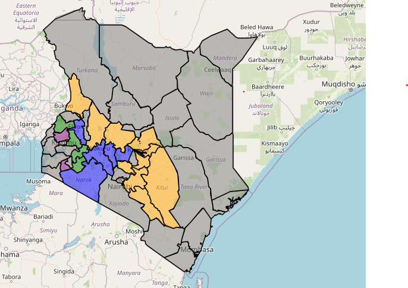

# Climate-Based Risk Assessment and Support System

[](https://opensource.org/licenses/MIT)
[](https://www.python.org/)
[](https://github.com/kiptoorono/Climate-Based-Risk-Assessment-and-Support-System/stargazers)
[](https://github.com/kiptoorono/Climate-Based-Risk-Assessment-and-Support-System/network/members)
[](https://github.com/kiptoorono/Climate-Based-Risk-Assessment-and-Support-System/issues)
[](https://github.com/kiptoorono/Climate-Based-Risk-Assessment-and-Support-System/pulls)

A comprehensive system for assessing and managing climate-related risks in agricultural regions, providing data-driven insights and recommendations for farmers and agricultural stakeholders.

## Overview

This system combines historical climate data analysis with machine learning-based forecasting to assess various climate risks including drought, heat stress, and flooding. It provides detailed risk assessments at both county and agro-ecological zone levels, along with actionable recommendations for farmers.



The system primarily focuses on assessing climate risks within specific counties and agro-ecological zones in Kenya, as visually represented in the map above, providing detailed analysis and recommendations tailored to these regions.

## Features

- **Multi-hazard Risk Assessment**
  - Drought risk evaluation
  - Heat stress analysis
  - Flood risk assessment
  - Combined risk scoring

- **Temporal Analysis**
  - Historical data analysis
  - Near-term forecasting (2025)
  - Mid-term forecasting (2026-2027)
  - Long-term forecasting (2028+)

- **Spatial Analysis**
  - County-level assessments
  - Agro-ecological zone mapping
  - Regional risk patterns

- **Decision Support**
  - Crop-specific recommendations
  - Zone-based advisories
  - Risk mitigation strategies
  - Adaptation planning

## Project Structure

```
├── Analysis/                    # Analysis scripts and notebooks
├── Climate risk support/        # Support system components
├── Data/                       # Processed and raw data
├── Data Downloading Scripts/    # Scripts for data collection
├── Data Processing/            # Data preprocessing and cleaning
├── LSTM/                       # LSTM-based forecasting models
├── Visualisation/              # Visualization tools and scripts
├── risk_assesment.py          # Core risk assessment module
├── riskassesmentmodel.py      # Risk assessment model implementation
├── Merge Forcasts.py          # Forecast merging and processing
└── requirements.txt           # Project dependencies
```

## Data Sources

### TAMSAT Rainfall Data
- **Source**: [TAMSAT Rainfall Dataset](https://research.reading.ac.uk/tamsat/rainfall/)
- **Version**: v3.1 (released 1st July 2020)
- **Coverage**: African continent, including Madagascar
- **Resolution**: 0.0375° (approx. 4km)
- **Temporal Coverage**: 1st January 1983 to present
- **Format**: netCDF
- **Variables**: 
  - `rfe`: Raw rainfall estimates
  - `rfe_filled`: Temporally complete rainfall record

### TAMSAT Soil Moisture Data
- **Source**: [TAMSAT Soil Moisture Dataset](https://research.reading.ac.uk/tamsat/soil-moisture/)
- **Version**: v2.3.1 (released January 2025)
- **Coverage**: African continent, including Madagascar
- **Resolution**: 0.25° (approx. 25km)
- **Temporal Coverage**: 1st January 1983 to present
- **Format**: netCDF
- **Variables**: 
  - `sm_c4grass`: Soil moisture availability factor for plants (0-100)

### Data Access
Both datasets are freely available under the Creative Commons Attribution 4.0 International license (CC BY 4.0).

## Installation

1. Clone the repository:
```bash
git clone [repository-url]
cd Climate-Based-Risk-Assessment-and-Support-System
```

2. Create and activate a virtual environment:
```bash
python -m venv new_env
source new_env/bin/activate  # On Windows: new_env\Scripts\activate
```

3. Install dependencies:
```bash
pip install -r requirements.txt
```

## Key Dependencies

- **Data Processing**: pandas, numpy, xarray
- **Machine Learning**: tensorflow, scikit-learn, xgboost
- **Visualization**: matplotlib, seaborn, folium
- **Geospatial**: geopandas, rasterio, rioxarray
- **Web Framework**: Flask

## Usage

1. **Data Preparation**
   - Place your climate data in the `Data/` directory
   - Ensure data includes rainfall, temperature, and soil moisture measurements

2. **Risk Assessment**
```python
from risk_assesment import generate_climate_risk_assessment

# Generate risk assessment
results = generate_climate_risk_assessment(
    data_path='path/to/merged_data.csv',
    output_dir='risk_assessment_results',
    zone_data_path='path/to/zone_data.csv'
)
```

3. **View Results**
   - Check the `risk_assessment_results/` directory for generated reports
   - Review visualizations in the `Visualisation/` directory

## Risk Assessment Methodology

The system uses a comprehensive approach to risk assessment:

1. **Data Analysis**
   - Historical baseline calculation
   - Statistical analysis of climate variables
   - Trend identification

2. **Risk Calculation**
   - Drought Index: Based on rainfall deviation and soil moisture
   - Heat Stress: Temperature anomalies and extreme events
   - Flood Risk: Rainfall intensity and soil saturation

3. **Risk Scoring**
   - Severity levels: Low, Mild, Moderate, Severe
   - Weighted scoring system
   - Zone-specific thresholds

## Contributing

1. Fork the repository
2. Create a feature branch
3. Commit your changes
4. Push to the branch
5. Create a Pull Request

## License

MIT License

Copyright (c) 2024 Climate-Based Risk Assessment and Support System

Permission is hereby granted, free of charge, to any person obtaining a copy
of this software and associated documentation files (the "Software"), to deal
in the Software without restriction, including without limitation the rights
to use, copy, modify, merge, publish, distribute, sublicense, and/or sell
copies of the Software, and to permit persons to whom the Software is
furnished to do so, subject to the following conditions:

The above copyright notice and this permission notice shall be included in all
copies or substantial portions of the Software.

THE SOFTWARE IS PROVIDED "AS IS", WITHOUT WARRANTY OF ANY KIND, EXPRESS OR
IMPLIED, INCLUDING BUT NOT LIMITED TO THE WARRANTIES OF MERCHANTABILITY,
FITNESS FOR A PARTICULAR PURPOSE AND NONINFRINGEMENT. IN NO EVENT SHALL THE
AUTHORS OR COPYRIGHT HOLDERS BE LIABLE FOR ANY CLAIM, DAMAGES OR OTHER
LIABILITY, WHETHER IN AN ACTION OF CONTRACT, TORT OR OTHERWISE, ARISING FROM,
OUT OF OR IN CONNECTION WITH THE SOFTWARE OR THE USE OR OTHER DEALINGS IN THE
SOFTWARE.

## Contact

ronobrian058@gmail.com

## Acknowledgments

- [List any acknowledgments or references]