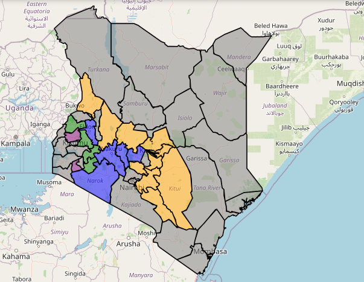

# Climate-Based Risk Assessment and Support System

[](https://opensource.org/licenses/MIT)
[](https://www.python.org/)
[](https://github.com/kiptoorono/Climate-Based-Risk-Assessment-and-Support-System/stargazers)
[](https://github.com/kiptoorono/Climate-Based-Risk-Assessment-and-Support-System/network/members)
[](https://github.com/kiptoorono/Climate-Based-Risk-Assessment-and-Support-System/issues)
[](https://github.com/kiptoorono/Climate-Based-Risk-Assessment-and-Support-System/pulls)

A comprehensive system for assessing and managing climate-related risks in agricultural regions, providing data-driven insights and recommendations for farmers and agricultural stakeholders.

## Overview

This system combines historical climate data analysis with machine learning-based forecasting to assess various climate risks including drought, heat stress, and flooding. It provides detailed risk assessments at both county and agro-ecological zone levels, along with actionable recommendations for farmers.



The system primarily focuses on assessing climate risks within specific counties and agro-ecological zones in Kenya, as visually represented in the map above, providing detailed analysis and recommendations tailored to these regions.

## Features

- **Multi-hazard Risk Assessment**
  - Drought risk evaluation
  - Heat stress analysis
  - Flood risk assessment
  - Combined risk scoring

- **Temporal Analysis**
  - Historical data analysis
  - Near-term forecasting (2025)
  - Mid-term forecasting (2026-2027)
  - Long-term forecasting (2028+)

- **Spatial Analysis**
  - County-level assessments
  - Agro-ecological zone mapping
  - Regional risk patterns

- **Decision Support**
  - Crop-specific recommendations
  - Zone-based advisories
  - Risk mitigation strategies
  - Adaptation planning

## Project Structure

```
📂 Analysis/                    # Analysis scripts and notebooks
📂 Climate risk support/        # Flask web application components (standalone)
📂 Data/                       # Processed and raw data
📂 Data Downloading Scripts/    # Scripts for data collection
📂 Data Processing/            # Data preprocessing and cleaning
📂 LSTM/                       # LSTM-based forecasting models
📂 Visualisation/              # Visualization tools and scripts
📄 risk_assesment.py          # Core risk assessment module
📄 riskassesmentmodel.py      # Risk assessment model implementation
📄 Merge Forcasts.py          # Forecast merging and processing
📄 requirements.txt           # Project dependencies
```

## Execution Workflow

To run the core climate risk assessment process, follow these steps in order:

1.  **Data Downloading:** Execute the scripts in the `Data Downloading Scripts/` directory to collect raw climate data.
2.  **Data Processing:** Run the scripts in the `Data Processing/` directory to clean and preprocess the raw data. This step also includes feature engineering.
3.  **LSTM Forecasting:** Utilize the scripts/models in the `LSTM/` folder to generate climate forecasts based on the processed data.
4.  **Risk Assessment:** Run the `risk_assesment.py` script, which uses the processed data and LSTM forecasts to perform the climate risk assessment.

The `Climate risk support/` directory contains a standalone Flask web application that provides a user interface for interacting with the system, including viewing results and potentially running parts of the workflow. This application can be run independently after the necessary data has been processed.

## Data Sources

### TAMSAT Rainfall Data

The TAMSAT Rainfall Dataset, version v3.1 released on 1st July 2020, provides rainfall estimates and rainfall anomaly estimates for the entire African continent, including Madagascar. This data has a spatial resolution of 0.0375° (approximately 4km) and covers the period from 1st January 1983 to the present. The data is available in netCDF format and includes two main variables: `rfe` for raw rainfall estimates and `rfe_filled` for a temporally complete rainfall record.

### TAMSAT Soil Moisture Data

The TAMSAT Soil Moisture Dataset, version v2.3.1 released in January 2025, offers soil moisture estimates and anomaly estimates relative to the 2001-2020 climatology for the African continent, including Madagascar. This dataset has a spatial resolution of 0.25° (approximately 25km) and temporal coverage from 1st January 1983 to the present. Provided in netCDF format, the key variable is `sm_c4grass`, which represents the soil moisture availability factor for plants, ranging from 0 to 100.

### Data Access

Both the TAMSAT Rainfall Dataset ([https://research.reading.ac.uk/tamsat/rainfall/](https://research.reading.ac.uk/tamsat/rainfall/)) and the TAMSAT Soil Moisture Dataset ([https://research.reading.ac.uk/tamsat/soil-moisture/](https://research.reading.ac.uk/tamsat/soil-moisture/)) are freely available for operational, research, and commercial use under the terms of the Creative Commons Attribution 4.0 International license (CC BY 4.0).

## Live Demo

The application is currently deployed and available live at the following URL: [https://climate-risk-assessment.up.railway.app/](https://climate-risk-assessment.up.railway.app/)

## Installation

1. Clone the repository:

```bash
git clone [repository-url]
cd Climate-Based-Risk-Assessment-and-Support-System
```

2. Create and activate a virtual environment:

   **For Linux/macOS:**
   ```bash
   python3 -m venv new_env
   source new_env/bin/activate
   ```

   **For Windows:**
   ```bash
   python -m venv new_env
   new_env\Scripts\activate
   ```

3. Install dependencies:

```bash
pip install -r requirements.txt
```

## Key Dependencies

- **Data Processing**: pandas, numpy, xarray
- **Machine Learning**: tensorflow, scikit-learn, xgboost
- **Visualization**: matplotlib, seaborn, folium
- **Geospatial**: geopandas, rasterio, rioxarray
- **Web Framework**: Flask

## Usage

1.  **Data Preparation**
    - Place your climate data in the `Data/` directory
    - Ensure data includes rainfall, temperature, and soil moisture measurements

2.  **Risk Assessment**

    ```python
    from risk_assesment import generate_climate_risk_assessment

    # Generate risk assessment
    results = generate_climate_risk_assessment(
        data_path='path/to/merged_data.csv',
        output_dir='risk_assessment_results',
        zone_data_path='path/to/zone_data.csv'
    )
    ```

3.  **View Results**
    - Check the `risk_assessment_results/` directory for generated reports
    - Review visualizations in the `Visualisation/` directory

## Risk Assessment Methodology

The system employs a multi-layered approach combining statistical and machine learning methods for robust climate risk assessment:

### Data Analysis & Preprocessing

- Historical climate data aggregation and baseline calculation
- Extraction of relevant climate features (rainfall, temperature, soil moisture)
- Temporal and spatial trend identification and anomaly detection

### Risk Calculation & Feature Engineering

- Calculation of indices such as Drought Index (rainfall z-score and soil moisture ratio)
- Heat stress quantification using temperature anomalies and threshold exceedance
- Flood risk assessment based on rainfall intensity and soil saturation levels

### Risk Classification & Scoring

- Classification into severity levels: Low, Mild, Moderate, Severe
- Use of Random Forest classifiers trained on engineered features for drought, heat, flood, and rainfall risks
- Weighted scoring system integrating multiple risk factors with zone-specific thresholds for localized risk evaluation

## Contributing

1.  Fork the repository
2.  Create a feature branch
3.  Commit your changes
4.  Push to the branch
5.  Create a Pull Request

## License

MIT License

Copyright (c) 2024 Climate-Based Risk Assessment and Support System

Permission is hereby granted, free of charge, to any person obtaining a copy
of this software and associated documentation files (the "Software"), to deal
in the Software without restriction, including without limitation the rights
to use, copy, modify, merge, publish, distribute, sublicense, and/or sell
copies of the Software, and to permit persons to whom the Software is
furnished to do so, subject to the following conditions:

The above copyright notice and this permission notice shall be included in all
copies or substantial portions of the Software.

THE SOFTWARE IS PROVIDED "AS IS", WITHOUT WARRANTY OF ANY KIND, EXPRESS OR
IMPLIED, INCLUDING BUT NOT LIMITED TO THE WARRANTIES OF MERCHANTABILITY,
FITNESS FOR A PARTICULAR PURPOSE AND NONINFRINGEMENT. IN NO EVENT SHALL THE
AUTHORS OR COPYRIGHT HOLDERS BE LIABLE FOR ANY CLAIM, DAMAGES OR OTHER
LIABILITY, WHETHER IN AN ACTION OF CONTRACT, TORT OR OTHERWISE, ARISING FROM,
OUT OF OR IN CONNECTION WITH THE SOFTWARE OR THE USE OR OTHER DEALINGS IN THE
SOFTWARE.

## Contact

ronobrian058@gmail.com

## Acknowledgments

- [List any acknowledgments or references]

